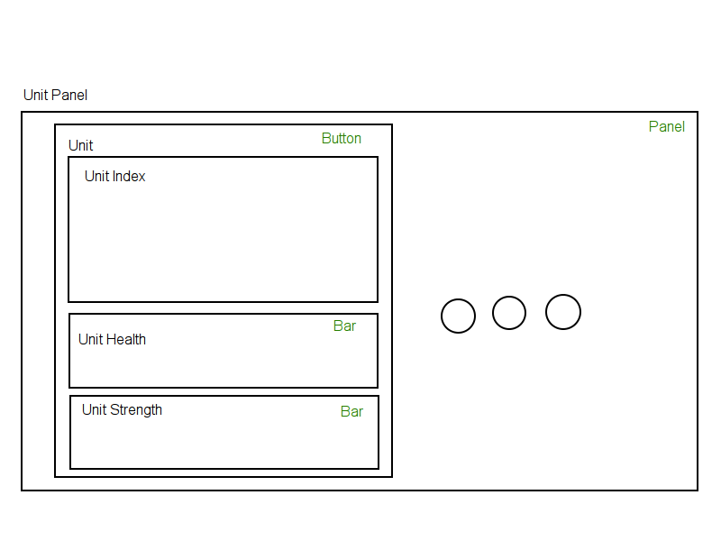
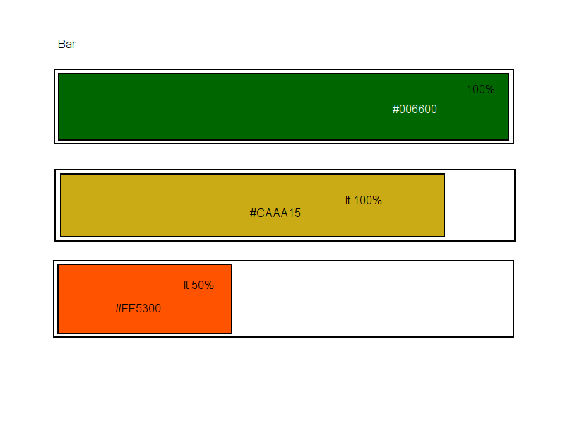

Lol UI
======

Experimental UI on [pixi.js](https://github.com/GoodBoyDigital/pixi.js/)

## Initialization
```
npm i
```

## Development
```
gulp
```
Then open [http://localhost:8000/](http://localhost:8000/)

### Testing
```
open ./src/scripts/button/button-test.html
```

## Building
```
gulp build
```
Then open in browser
```
open ./dist/index.html
```

## Specifications


