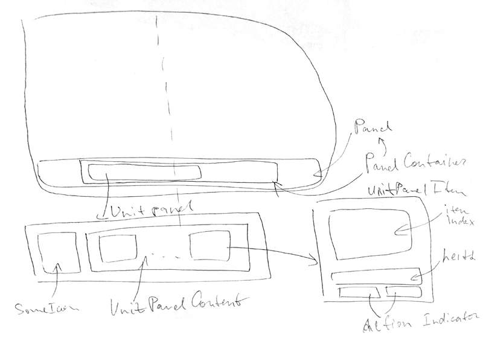

# Lol UI

Experimental UI on [pixi.js](https://github.com/GoodBoyDigital/pixi.js/)

## Components
- Button
- Progressbar
- Indicator
- Panel
- ControlPanel
- UnitPanel

## Initialization
```sh
npm i
```

## Development
```sh
gulp
```
Then open [http://localhost:8000/](http://localhost:8000/)

### Testing
```sh
open ./src/scripts/button/button-test.html
```

## Building
```sh
gulp build
```
Then open in browser
```sh
open ./dist/index.html
```

## Specifications



## License
MIT © [Vladimir Rodkin](https://github.com/VovanR)
